# 🏆 PlayNear (LocalSports) — Local Sports Tournament & Community Platform

### Discover and Join Local Sports Tournaments

**PlayNear** (LocalSports) is a full-stack web platform designed to connect local sports tournament organizers, sports clubs, team captains, and athletes. Built with **Next.js 15 (App Router), TypeScript, Tailwind CSS, Supabase (PostgreSQL, Auth, Storage), Leaflet / Google Maps, and Razorpay**.

The platform replaces the scattered way local tournaments are traditionally organized and promoted—through WhatsApp groups, Instagram posts, physical posters, and personal contacts—with a centralized hub for tournament discovery, interactive map search, team management, automated bracket generation, and registration workflows.

---

## ✨ Features

### 📍 Tournament Discovery & Geo-Search
- **Browse & Filter:** Discover local tournaments filtered by sport, status (*Registration Open*, *Upcoming*, *In Progress*, *Completed*), and city.
- **Interactive Map:** Leaflet map with Google Maps roadmap and satellite tiles.
- **Location Detection:** One-tap browser GPS detection (`navigator.geolocation`) with accuracy radius circles.
- **Radius Search:** Distance radius filters (**Within 10 km**, **Within 25 km**, **Within 50 km**, or **All Distances**) with Haversine distance calculations.
- **Turn-by-Turn Directions:** Direct Google Maps turn-by-turn navigation links to tournament venues.

### ⚡ Automated Tournament Fixture Engine
- **Single Elimination:** 1-Click bracket generator with automatic power-of-2 Bye seeding and winner progression.
- **Round-Robin:** Automated fixture generator using the Berger rotation algorithm ensuring every team plays each other.
- **Real-time Standings:** Points tables with sport-specific tiebreakers (Goal Difference, Net Run Rate, Set Difference) and 5-match form pills (`W`, `D`, `L`).

### 💳 Tournament Registration & Razorpay Payments
- **Captain Registration:** Squad registration for upcoming tournaments with entry fee validation.
- **Free Tournaments:** Instant one-click registration.
- **Paid Tournaments:** Integrated Razorpay checkout with server-side order generation (`/api/payments/create-order`) and HMAC-SHA256 signature verification (`/api/payments/verify`).
- **Test Mode Fallback:** Automatic fallback to simulated test mode when Razorpay credentials are not configured.

### 👥 Teams & Squad Management
- **Club Management:** Create and manage sports clubs (name, sport, city, squad capacity, positions needed).
- **Roster & Roles:** Manage squad rosters with jersey numbers and member roles.
- **Athlete Applications:** Players can send join requests specifying preferred playing position and a personal note.
- **Captain Approvals:** Captains can review, accept, or reject incoming player applications.
- **Safe Team Deletion:** Cascading cleanup RPC function (`delete_team_by_captain`).

### 🛡️ Organizer Management Portal (`/organizer`)
- **Organizer Dashboard:** Real-time metrics on total tournaments hosted, active events, registered teams, and entry fees collected.
- **Tournament Creation Wizard (`/organizer/tournaments/new`):** Configure sport, format, entry fee, dates, max teams, venue address, and rules.
- **Tournament Manager (`/organizer/tournaments/[id]`):** Edit tournament information, review pending squad registrations (Approve / Reject), view team rosters, or cancel events.

### 👤 Player Hub & Profile
- **My Teams (`/my-teams`):** Track all teams you captain or play for.
- **Registered Tournaments (`/registered-tournaments`):** Track status of tournament registrations (*Pending*, *Approved*, *Rejected*).
- **User Profile (`/profile`):** Edit profile details, primary sport, secondary sports, playing position, bio, experience, and upload custom avatar to Supabase Storage.
- **Secure Authentication:** Password complexity validation (8+ characters, uppercase, lowercase, numbers) with session handling.

### 🔒 Supabase Database & Security (RLS)
- Complete Row-Level Security policies across all database tables.
- Custom PostgreSQL stored procedures (RPCs) for atomic transactional operations.
- Automatic profile creation trigger on user signup.

---

## 📸 Screenshots

A quick look at the PlayNear platform, including tournament discovery, teams, player dashboards, organizer management, authentication, and tournament workflows.

### 🏠 Home & Tournament Discovery

<table>
  <tr>
    <td align="center" valign="top" width="25%">
      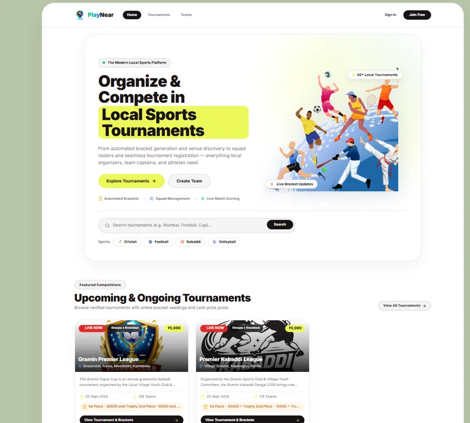<br>
      <sub><b>Home Page</b></sub>
    </td>
    <td align="center" valign="top" width="25%">
      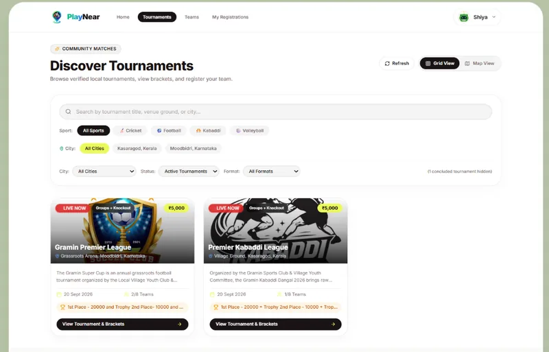<br>
      <sub><b>Tournament Discovery</b></sub>
    </td>
    <td align="center" valign="top" width="25%">
      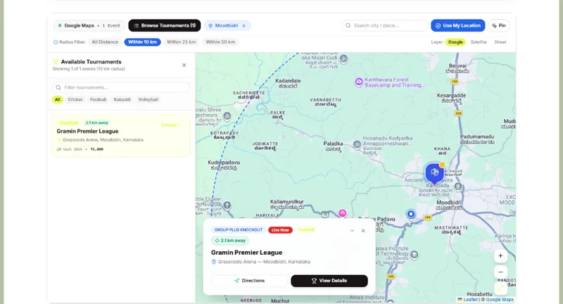<br>
      <sub><b>Interactive Map</b></sub>
    </td>
    <td align="center" valign="top" width="25%">
      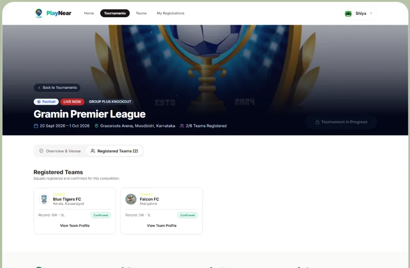<br>
      <sub><b>Tournament Details</b></sub>
    </td>
  </tr>
</table>

### 👤 Player Features

<table>
  <tr>
    <td align="center" valign="top" width="25%">
      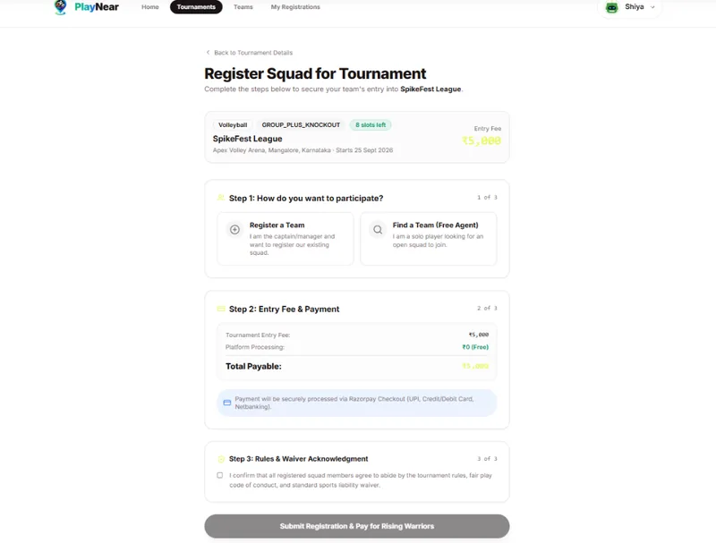<br>
      <sub><b>Tournament Registration</b></sub>
    </td>
    <td align="center" valign="top" width="25%">
      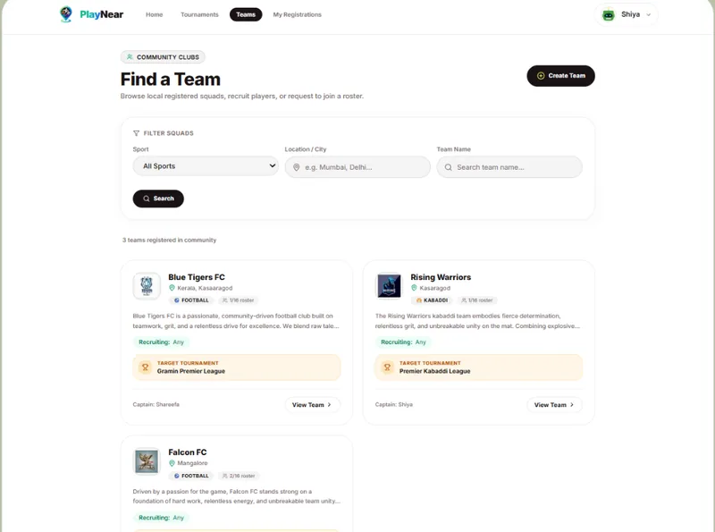<br>
      <sub><b>Teams Directory</b></sub>
    </td>
    <td align="center" valign="top" width="25%">
      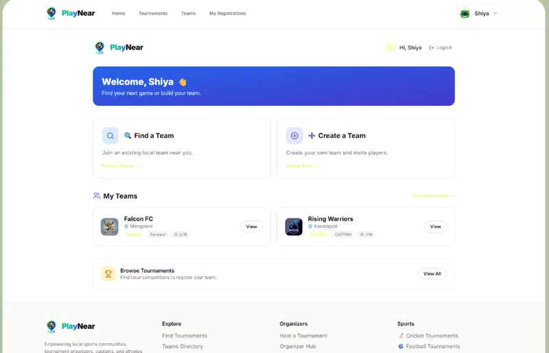<br>
      <sub><b>Player Dashboard</b></sub>
    </td>
    <td align="center" valign="top" width="25%">
      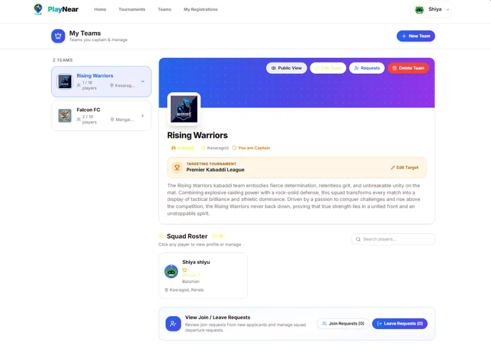<br>
      <sub><b>My Teams</b></sub>
    </td>
  </tr>
</table>

### 🏆 Tournament Management

<table>
  <tr>
    <td align="center" valign="top" width="25%">
      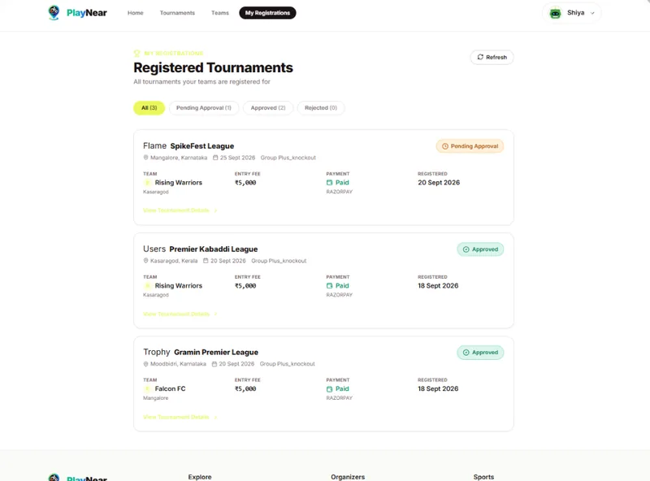<br>
      <sub><b>Registered Tournaments</b></sub>
    </td>
    <td align="center" valign="top" width="25%">
      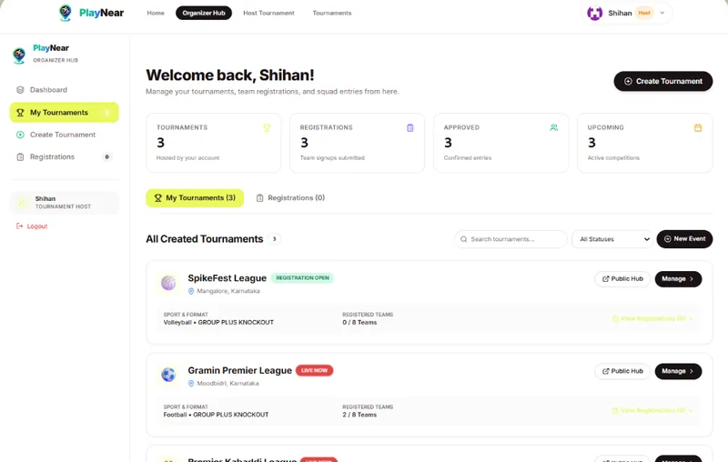<br>
      <sub><b>Organizer Hub</b></sub>
    </td>
    <td align="center" valign="top" width="25%">
      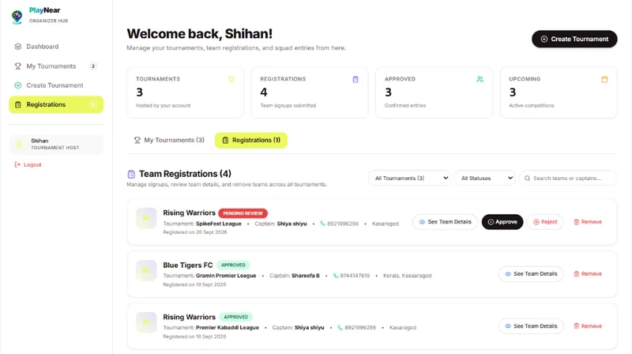<br>
      <sub><b>Organizer Registrations</b></sub>
    </td>
    <td align="center" valign="top" width="25%">
      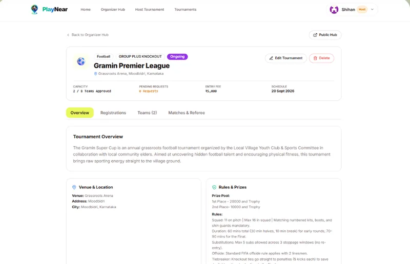<br>
      <sub><b>Tournament Management</b></sub>
    </td>
  </tr>
</table>

### ⚙️ Profile & Authentication

<table>
  <tr>
    <td align="center" valign="top" width="25%">
      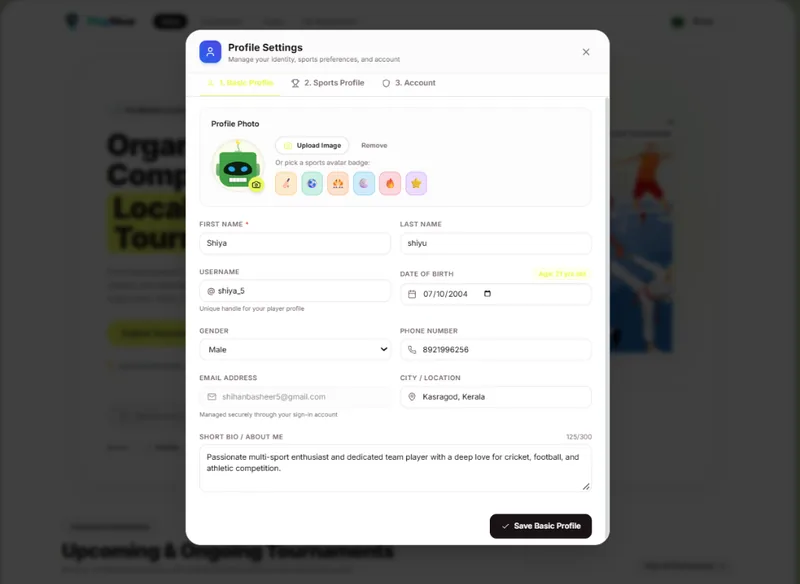<br>
      <sub><b>Profile Settings</b></sub>
    </td>
    <td align="center" valign="top" width="25%">
      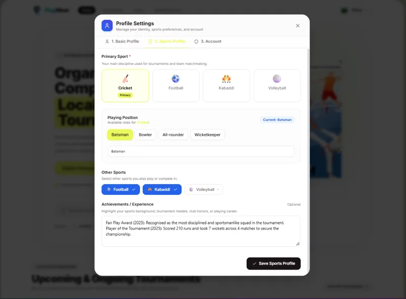<br>
      <sub><b>Sports Preferences</b></sub>
    </td>
    <td align="center" valign="top" width="25%">
      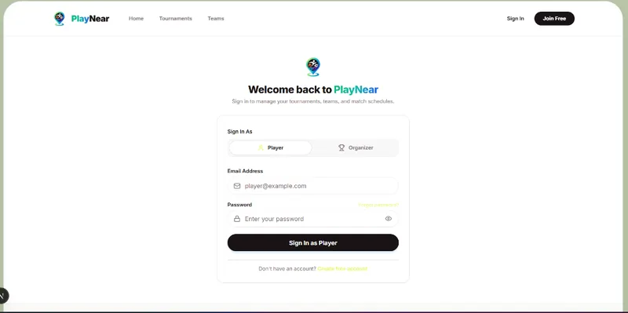<br>
      <sub><b>Sign In</b></sub>
    </td>
    <td align="center" valign="top" width="25%">
      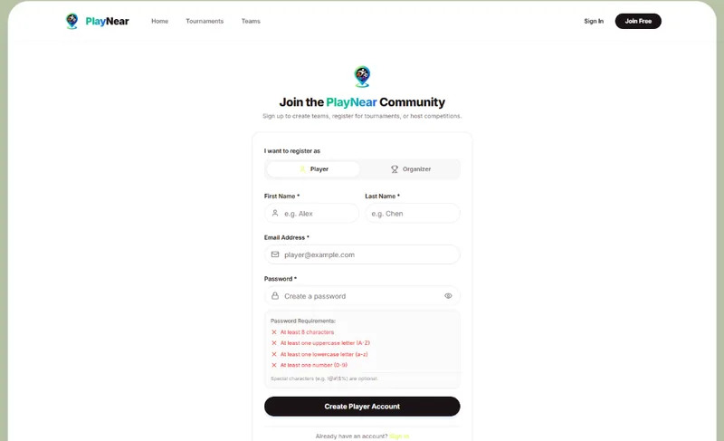<br>
      <sub><b>Sign Up</b></sub>
    </td>
  </tr>
</table>

---

## 🛠️ Tech Stack

| Layer | Technology |
| :--- | :--- |
| **Framework** | Next.js 15 (App Router, Server Actions, Route Handlers) |
| **Frontend Library** | React 19 |
| **Language** | TypeScript |
| **Styling & UI** | Tailwind CSS + Lucide Icons + `class-variance-authority` |
| **Database & Auth** | Supabase PostgreSQL + Supabase Auth (`@supabase/ssr`, `@supabase/supabase-js`) |
| **Database Security** | Supabase Row-Level Security (RLS) & PostgreSQL RPCs |
| **Storage** | Supabase Storage (`avatars` bucket) |
| **Payments** | Razorpay Node SDK (`razorpay`) + Razorpay Checkout Modal |
| **Maps & Geolocation** | Leaflet (`leaflet`), Google Maps Platform & Tiles, Nominatim Geocoder |
| **Validation & Utilities** | Zod, date-fns, clsx, tailwind-merge |
| **Deployment** | Vercel |

---

## 🚀 Getting Started

### 1. Clone & Install Dependencies

```bash
git clone https://github.com/your-username/PlayNear.git
cd PlayNear
npm install
```

### 2. Configure Environment Variables

Create `.env.local` by copying `.env.example`:

```bash
cp .env.example .env.local
```

Set your configuration values in `.env.local`:

```env
# Supabase Configuration
NEXT_PUBLIC_SUPABASE_URL=https://your-project.supabase.co
NEXT_PUBLIC_SUPABASE_ANON_KEY=your-anon-key
SUPABASE_SERVICE_ROLE_KEY=your-service-role-key

# Google Maps Platform (Optional)
NEXT_PUBLIC_GOOGLE_MAPS_API_KEY=your-google-maps-api-key
NEXT_PUBLIC_GOOGLE_MAPS_MAP_ID=your-google-maps-map-id

# App URL
NEXT_PUBLIC_SITE_URL=http://localhost:3000

# Razorpay Configuration (Optional - runs in simulated test mode if omitted)
RAZORPAY_KEY_ID=your-razorpay-key-id
RAZORPAY_KEY_SECRET=your-razorpay-key-secret
NEXT_PUBLIC_RAZORPAY_KEY_ID=your-razorpay-key-id
```

> **Note:** Never commit `.env.local` or expose your `SUPABASE_SERVICE_ROLE_KEY` or `RAZORPAY_KEY_SECRET` publicly.

### 3. Configure Database in Supabase

Open your Supabase project and execute `supabase/schema.sql` inside the **Supabase SQL Editor**.

This provisions:
- Core application tables: `sports`, `profiles`, `teams`, `team_members`, `team_join_requests`, `team_leave_requests`, `tournaments`, `tournament_teams`, `stages`, `matches`, `match_events`.
- All Row-Level Security (RLS) policies.
- Custom functions (`get_or_create_sport`, `update_registration_status`, `delete_registration_by_organizer`, `delete_team_by_captain`).
- Supabase Storage bucket (`avatars`).
- Seed data for default sports: Cricket, Football, Kabaddi, Volleyball, Basketball, Badminton.

### 4. Start the Development Server

```bash
npm run dev
```

Open [http://localhost:3000](http://localhost:3000) in your browser.

---

## 📁 Project Structure

```text
├── public/                                    # Static assets, branding, and icons
├── screenshots/                               # Application screenshots for GitHub previews
│   ├── 01-home-hero.webp
│   ├── 02-home-community.webp
│   ├── 03-tournaments-discovery.webp
│   ├── 04-interactive-map.webp
│   ├── 05-tournament-details.webp
│   ├── 06-tournament-registration.webp
│   ├── 07-teams-directory.webp
│   ├── 08-dashboard.webp
│   ├── 09-my-teams.webp
│   ├── 10-registered-tournaments.webp
│   ├── 11-organizer-hub.webp
│   ├── 12-organizer-registrations.webp
│   ├── 13-organizer-tournament-manage.webp
│   ├── 14-profile-settings.webp
│   ├── 15-profile-sports.webp
│   ├── 16-signin.webp
│   └── 17-signup.webp
├── src/
│   ├── app/
│   │   ├── (auth)/
│   │   │   ├── login/page.tsx                 # User sign-in
│   │   │   └── signup/page.tsx                # User registration with password validation
│   │   ├── api/
│   │   │   ├── auth/                          # Auth callback & signup endpoints
│   │   │   ├── organizer/                     # Stats, tournaments & registration review APIs
│   │   │   ├── payments/                      # Razorpay create-order & verify endpoints
│   │   │   ├── player/                        # Player squads & tournament registration APIs
│   │   │   ├── profile/                       # User profile update & account deletion
│   │   │   ├── teams/                         # Team CRUD, join/leave requests & member APIs
│   │   │   └── tournaments/                   # Tournament registration API
│   │   ├── dashboard/page.tsx                 # Dashboard hub
│   │   ├── my-teams/page.tsx                  # Player's joined teams & squads
│   │   ├── organizer/
│   │   │   ├── page.tsx                       # Organizer dashboard (stats, tournaments, approvals)
│   │   │   └── tournaments/
│   │   │       ├── new/page.tsx               # Tournament creation wizard
│   │   │       └── [id]/page.tsx              # Organizer tournament manager & team review
│   │   ├── profile/page.tsx                   # User profile settings & bio
│   │   ├── registered-tournaments/page.tsx    # Tournaments the user has registered for
│   │   ├── teams/
│   │   │   ├── page.tsx                       # Team directory & search
│   │   │   ├── new/page.tsx                   # Create a new sports team
│   │   │   └── [id]/page.tsx                  # Team details, squad roster & join requests
│   │   ├── tournaments/
│   │   │   ├── page.tsx                       # Discovery with sport filters & Leaflet map
│   │   │   └── [slug]/
│   │   │       ├── page.tsx                   # Tournament details (Brackets, Standings, Teams, Venue)
│   │   │       └── register/page.tsx          # Squad registration & Razorpay payment flow
│   │   ├── layout.tsx                         # Root layout & theme wrapper
│   │   ├── page.tsx                           # Landing page & hero
│   │   └── globals.css                        # Global Tailwind styles
│   ├── components/
│   │   ├── ui/                                # Reusable UI primitives (Button, Card, Badge, Input, Tabs)
│   │   ├── profile/                           # Profile settings modal
│   │   ├── bracket-view.tsx                   # Knockout bracket tree visualization
│   │   ├── brand-logo.tsx                     # PlayNear brand identity logo
│   │   ├── edit-team-modal.tsx                # Squad details editor
│   │   ├── footer.tsx                         # Footer component
│   │   ├── map-view.tsx                       # Interactive Leaflet / Google Maps viewer with radius filters
│   │   ├── navbar.tsx                         # Navigation bar with user dropdown
│   │   ├── standings-table.tsx                # Points & standings table
│   │   └── tournament-card.tsx                # Tournament grid card with status badge
│   ├── lib/
│   │   ├── supabase/                          # Supabase client, server & middleware helpers
│   │   ├── tournament-engine/
│   │   │   ├── bracket-generator.ts           # Single elimination generator with Byes
│   │   │   ├── round-robin-generator.ts       # Round Robin generator (Berger rotation)
│   │   │   └── standings-calculator.ts        # Standings table points & tiebreaker calculator
│   │   ├── ensure-sport.ts                    # Sport lookup & fallback helper
│   │   ├── geo-utils.ts                       # Geocoding, Haversine distance, city coordinates dictionary
│   │   ├── google-maps.ts                     # Google Maps directions & static map helpers
│   │   ├── mock-data.ts                       # Fallback demo tournament dataset
│   │   ├── sports-config.ts                   # Sport rules, metrics, and scoring definitions
│   │   ├── tournament-status.ts               # Dynamic tournament lifecycle status calculations
│   │   ├── utils.ts                           # Formatting, currency, date & slug utilities
│   │   └── validation.ts                      # Password complexity & zod schema validators
│   ├── middleware.ts                          # Supabase session refresher middleware
│   └── types/
│       ├── database.types.ts                  # Supabase database TypeScript definitions
│       └── sports.types.ts                    # Sport presets & rules definitions
├── supabase/
│   └── schema.sql                             # Full PostgreSQL database schema, RLS & seed data
├── test-engine.ts                             # Tournament engine unit test suite
└── package.json
```

---

## 🗄️ Database

PlayNear uses **Supabase PostgreSQL** as its primary database.

The database contains tables for core application functionality:
- `profiles`: User profiles, sports interests, experience, and avatars
- `tournaments` & `tournament_teams`: Tournament metadata, rules, venue coordinates, and registrations
- `teams`, `team_members` & `team_join_requests`: Sports clubs, squads, rosters, and join applications
- `stages`, `matches` & `match_events`: Tournament stages, match fixtures, scores, and fixture events

Supabase Authentication manages user accounts and protected sessions, while Row-Level Security (RLS) policies safeguard user and organizer data access.

---

## 🧪 Tournament Engine Tests

The tournament engine can be tested using:

```bash
npx tsx test-engine.ts
```

*(On Windows PowerShell, run `npx.cmd tsx test-engine.ts` if `.ps1` script execution is disabled).*

The test suite validates:
* Single-elimination bracket generation
* Automatic power-of-2 Bye seeding and distribution
* Round-robin fixture generation (Berger rotation)
* Points and standings calculations with tiebreakers

---

## 🗺️ Project Vision

LocalSports / PlayNear aims to make local sports tournament discovery and participation effortless by connecting athletes, team captains, and tournament organizers onto one unified platform.

Instead of searching through fragmented WhatsApp groups, Instagram posts, posters, or personal contacts, players can discover tournaments near them, register squads, and track fixtures seamlessly.

---

## 🔮 Future Improvements

Planned future enhancements include:
* Real-time referee mobile scorekeeper console
* Push and email notifications for registration and fixture updates
* Advanced tournament formats (Double Elimination, Swiss system)
* Dedicated mobile application (React Native / PWA)
* Enhanced team chat and captain messaging

---

## 👨‍💻 Built With

**Next.js • React • TypeScript • Tailwind CSS • Supabase • PostgreSQL • Google Maps Platform • Leaflet • Razorpay**

---

## 📜 License

This project is open-source and available under the [MIT License](LICENSE).
